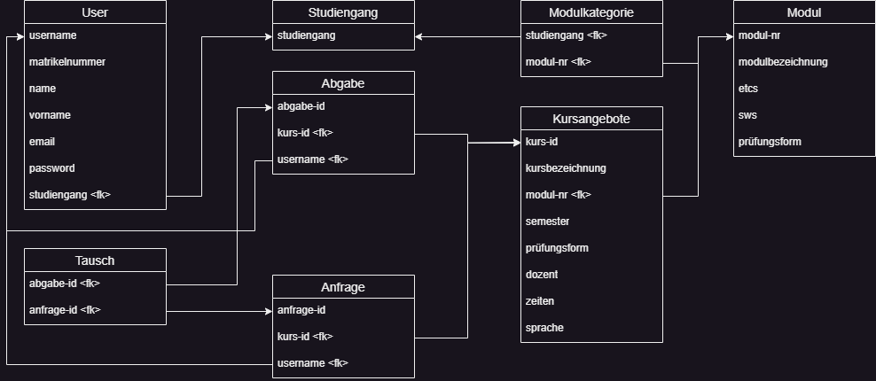

{: .no_toc }
# Data Model

Table of contents

+ ToC
{: toc }
{: .text-delta }

The data model includes the "User" and "Studienbüro Mitarbeiter" tables, which are used to store student and staff data. Each student in the "User" entity is assigned to a study programme in the "Studiengang" entity. The "Modul" table stores module master data, while the "Kursangebote" table stores the specific details of individual module offerings.

Study programmes can be assigned to modules to define which students are permitted to enrol on the corresponding course. Since one module can be assigned to several study programmes and one study programme can contain several modules, this represents an n:m relationship. To represent this relationship, the helper table "Modulkategorie" was created.

In order to implement the solution to the problem, the relationship between courses and students also has to be represented. To this end, students are stored together with the course they wish to withdraw from and the time of submission in the "Abgabe" table. The time is important for the waiting list principle. Course requests are stored in the "Anfrage" table using the same principle. Finally, matching pairs of submissions and requests are stored in the "Tausch" table.
