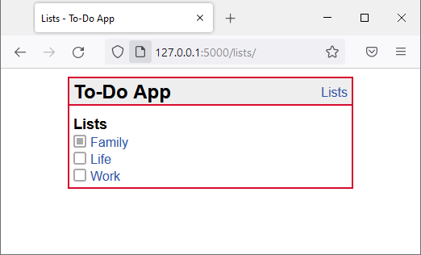

{: .attention }
> Any text enclosed by `[ ]` are **placeholders**, including the opening and closing brackets.
>
> You may delete this `attention` box.

# [Kursbörse by ASDF Development]

[This platform is initially designed to allow students in Department 1 at HWR Berlin to offer their unused course slots to other students. It is also intended to make it easy to register for courses that were not initially available.]

## Sample App Screen

---

## Improvements / Refinements since First Submission

[Assess implementation of improvements / refinements since First Submission (as presented during Oral Examination).]

{: .fs-2 }
Last build: {{ site.time | date: '%d %b %Y, %R%:z' }}
