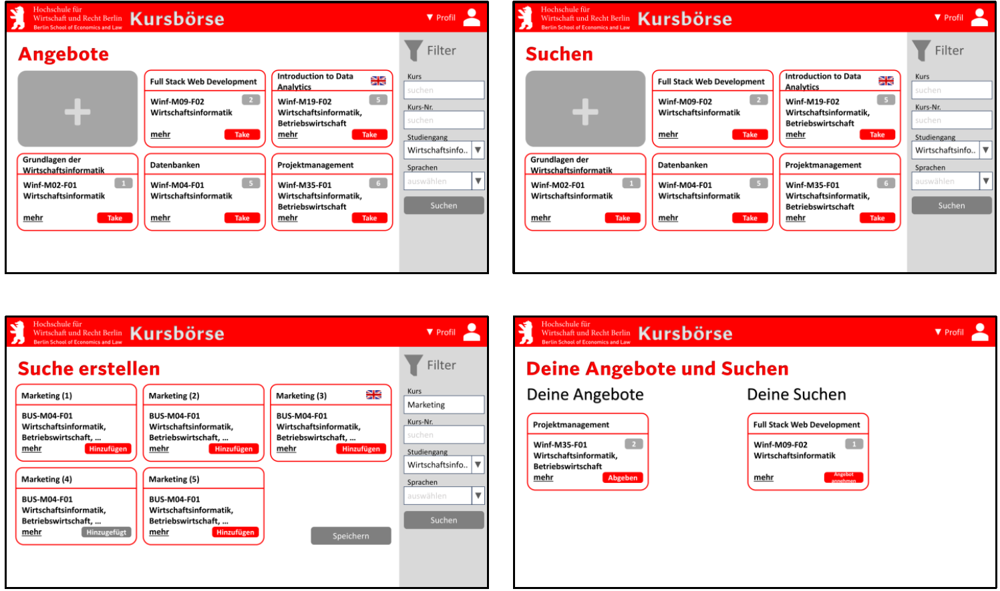

# Kursbörse by ASDF Development

This platform is initially designed to allow students in Department 1 at HWR Berlin to offer their unused course slots to other students. It is also intended to make it easy to register for courses that were not initially available.

## Sample App Screen

---

## Improvements / Refinements since First Submission

Since the first submission, we have successfully implemented the study office’s assessment functions. We revamped the website’s original design using Bootstrap, albeit with a few minor complications. We have also rectified a few minor errors.

{: .fs-2 }
Last build: {{ site.time | date: '%d %b %Y, %R%:z' }}
